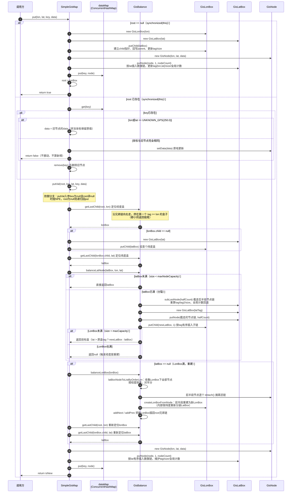
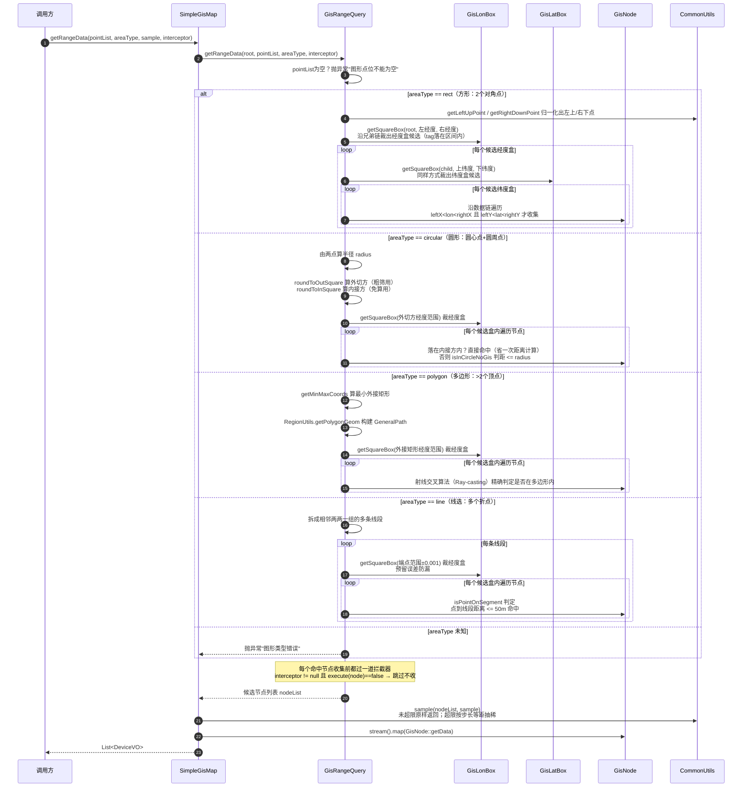

# 赵子杰-技术分享

# Section1：入职初体验 

```
自7月28日晚从深圳入职培训归来，至今已工作近一个月。借着这次机会在这个小节，与大家分享我在这段时间中的一些心路历程。
```

### 历程1：关于git提交

> 在推赞比亚项目期间，有一个需求是新增一个接口，当时我为了一些兼容性考虑，顺手改了两个可能会受到影响的接口，随后在一次 `git puish` 中同时修改了**三个接口**，（众所周知，赞比亚项目是基于icc4.3二开，旧接口都是**稳定可用**的）；
>
> 在我提交后，周老师反馈其中一个接口报错，（众所周知，smp网元是那种**业务性很强**的网元，一个参数的变更，往往要修改几处甚至十几处代码段）我当时就想回滚那一个报错的接口到旧版本，然后再只修改这一个接口；
>
> 这时尴尬的问题来了，三个接口变更在一次git提交记录里，如果回滚，那两个开发好的接口也要被迫回滚，这时候周老师说了这么一句话，令我印象深刻：“**提交代码的时候，不要将多个需求合并在一次提交记录里，你看你现在就很麻烦”。**

```
这次经历让我的心态从“知道开发规范”真正转变为“认同开发规范”：对于一个年轻的程序员，养成原子化提交的习惯是很重要的，宁可小而频繁的提交，也不要来一个巨量的提交，这会为后面排查错误埋下隐患；
同时，每次代码推送都附带明确的注释，这样在进行review时，可读性也会好一些。
```

### 历程2：关于ai的使用

这里我想分享我印象比较深的两个场景

> 当时在review SMP网元的时，有一个类是专门为基础数据变更提供本地内存（里面维护了十多个concurrentHashMap），且每次数据变更时都要完成双写缓存的操作（本地哈希+redis），我当时在想这种设计是不是冗余的？
>
> 我让AI去review了一下代码，不出所料，AI用**最直接、最真相、最不绕弯、最扎心、最硬核、最干脆** 的方式告诉我：**“冗余”**
>
> 我就去问了一下龙哥，为什么要设计这些本地内存哈希，这样的设计是否冗余？
>
> 龙哥当时解释：我们的redis存储有上限，这种方案是出于**成本的控制**

> 最开始接需求的时候，我辅助宇航哥排查定位一个问题：**复合图标生成后前台只显示部分复合图标**；
>
> 当时我为了快速介入业务，让ai对这个接口进行review，ai告诉我代码有一个**潜在的问题：在将复合图标传到oss服务时，没有声明bucket的路径**；
>
> 后面找宇航哥聊，才知道smp对于对象存储的路径已经**以配置文件的形式写到nacos里**了

```
这两个场景其实都反映了一个问题：AI确实在代码审查的基础上又快又稳，但涉及性能权衡（场景1）、跨服务的业务（场景2），它给的东西得带着脑子看，不能照单全收。
（模拟一下AI在review的时给出结论的口吻）一句话总结：AI 在"执行方案"上极强，在"判断该用哪种方案"上基本靠程序员自己。
但这句话显然有个前置条件：要对需求背景、业务背景、系统架构了解的足够好。
```

### 历程3：关于对齐颗粒度

> 宇航哥平时除了工作上的内容，嘱咐最多的一句话就是：**遇到了问题不要自己憋着，即使做不出来也要及时反馈，和协作的同事或导师对齐进度很重要**。
>
> 在此也想感谢宇航哥，对于平时我在smp网元上的一些问题，基本是**有问必答**

### 历程4：一次面试经历

> 这里想分享一个校招时期，让我印象深刻的字节二面面试官，他当时让我模拟去写一个阻塞队列，他看出了我有点无从下手，就循序渐进引导我，将这个**复杂的问题拆解**：
>
> 1. 先想象一个正常的队列的数据结构怎么去实现
> 2. 如何显式体现出这个队列的阻塞状态
> 3. 阻塞的边界条件是什么
> 4. 你可以用伪代码的形式把核心逻辑写出来
>
> ... ...
>
> 虽然最后我收到了感谢信，但这次经历让我印象深刻：**拆解复杂问题的能力对于一个程序员来说是很重要的**。

### Section1小结

做一个总结的话，我想凝练成以下几点：

- 提交代码尽量做**原子性提交**，不要**巨量提交**
- 对 AI 给出的结论保持**“辩证心”**，结合**项目的背景**独立判断
- 手里有需求时，一定要给到及时的反馈，**无论这个反馈是好的还是坏的**
- 如果你觉得一个**需求比较复杂**，可能是**它被拆得不够细**

上面聊的都是比较顺利的部分，下面分享一个我感觉不是很顺利的点：

### 现象：关于需求细节的确认方式
> 在推进赞比亚项目期间，需求整体是有 PRD 文档的，但文档里没有展开的一些细节，我们通常是通过口头沟通来对齐的。口头沟通本身响应很快，但细节如果只停留在口头上，会带来两个在我身上真实发生过的问题：
> 1. 口头信息容易遗漏或记错：比如把“0-未完成、1-已完成”听成了“0-已完成、1-未完成”；把 handle_status 字段的变更听成了 task_status；
> 2. 口头确认没有统一的落点，一旦出现理解偏差，就需要再花时间重新对齐，来回确认对双方的精力都是一种消耗。
> #### 如何解决
> 我的想法是：口头沟通照常进行，但沟通完之后,用一种**让需求细节留痕**的方式，我想到了以下几种：
> 1. 把确认过的细节补记到 PRD 里
> 2. 在 GitLab 上开一个 issue 并 assign 给对应开发
> 3. 在禅道上进行需求跟进
> 
> 这样做的好处是：万一出现问题，也可以快速**溯源**，定位是哪一次对齐产生了偏差，把精力放在解决问题上，而不是纠结谁记错了。

回归正题，既然是技术分享，就聊一些技术相关的。

# Section2：技术分享

### 版本号

####  前序：一些必要的名词解释

> - **不兼容的变动：**以前能用的功能现在废了，或者操作方式全改了，用户必须跟着调整才能继续用。比如删掉了一个常用按钮、改了核心接口，或者界面推倒重来。 
> - **向下兼容的变动：**以前的东西照常能用，只是多了点新花样或者修了点小毛病。 具体分两种：
>   - **加新功能**（比如多了个分享按钮） 
>   - **只修 bug 或优化性能**（比如不闪退了、登录变快了） 

软件版本号通常采用 **X.Y.Z** 的格式，其中 X、Y 和 Z 为非负整数，且禁止在数字前方补零。

- X 是主版本号
- Y 是次版本号
- Z 是修订号

互相之间用句点 `.` 隔开 


**主版本号**

当软件有重大更新时，比如**软件界面重新设计**、**功能架构大幅调整**、增加**不兼容的变动**等，主版本号需要进行递增，同时**次版本号和修订号必须归零**。如：`0.8.7` -> `1.0.0`。

- 当主版本号为 0 时通常表示**软件处于开发的初始阶段**。
- 当主版本号为 1 时通常代表**软件已经正式发行使用了**。

**次版本号**

当软件有**向下兼容**的新功能出现时，次版本号需要进行**递增**，同时**修订号必须归零**，而**主版本号保持不变**。如：`0.8.7` -> `0.9.0`。

**修订号**

当软件的功能做了一些**优化**或**修复了一些问题**时，修订号需要进行递增，而主版本号和次版本号都保持不变。如：`0.8.7` -> `0.8.8`。

**先行版本号**

先行版本号是可选填的内容，一般被标注在修订号之后，先加上一个连接号 `-` 再加上一连串以句点 `.` 分隔的标识符来修饰。标识符必须由 ASCII 字母数字和连接号 [0-9A-Za-z] 组成，且禁止留白。数字型的标识符禁止在前方补零。

如：`1.0.0-alpha`、`1.0.0-alpha.1`、`1.0.0-0.3.7`、`1.0.0-x.7.z.92`。

> 被标上先行版本号则表示这个版本的软件并非稳定，也有可能无法满足预期的兼容性需求。 

**版本编译信息**

版本编译信息也是可选填的内容，一般被标注在修订号或先行版本号之后，先加上一个加号 `+` 再加上一连串以句点 `.` 分隔的标识符来修饰。

标识符必须由 ASCII 字母数字和连接号 [0-9A-Za-z-] 组成，且禁止留白。

如：`1.0.0-alpha+001`、`1.0.0+20130313144700`、`1.0.0-beta+exp.sha.5114f85`。

**前缀标记**

有些时候我们会在版本号前增加一个前缀，比如 “v”，“ver”，“version”，这通常用来提醒阅读者后面一连串的数字与句点组合表示软件版本号。如：`v1.2.3`。但在计算机内部，仍以不带前缀标记的版本号区分软件的版本。

#### 发版需知

**版本号如何排序？**

对版本号进行排序时，需先把版本号拆分为**主版本号、次版本号、修订号及先行版本号**（版本编译信息忽略不计），然后**由左到右依序比较每个号段，由出现的第一个差异值用来决定先后顺序**。例如：`1.0.0` < `2.0.0` < `2.1.0` < `2.1.1`。

> 当主版本号、次版本号及修订号都相同时，才以先行版本号进行对比，而先行版本号的优先级低于**相关联的标准版本**。如：`1.0.0-alpha` < `1.0.0`。

https://leetcode.cn/problems/compare-version-numbers/

**版本号如何递增？**

每个号段必须以**整数数值**来递增。如：`1.9.1` -> `1.10.0` -> `1.11.0`。

**如何处理即将弃用的功能？**

在下一个次版本的**更新日志**里说明即将弃用的功能，然后在下一个主版本里移除弃用的功能。

> 更新日志：在一般的软件商城里都是对用户可见的
>
> 以下是我在手机里找到的bilibili软件的版本日志
>
> 
>
> 我的npm主页：
>
> [npm | Profile](https://www.npmjs.com/~tian_jiao_sirrrrrr) 

**发版后发现有误怎么办？**

如果不小心把错误的修改当成新版本号发行了，那也**不能去修改这一新版本的内容**，只能**另外再发行一个新版本号**来更正这个问题**并且恢复向下兼容**。

如果可以的话，最好将有问题的版本号记录到文件中，告诉使用者问题所在，让他们能够意识到这是有问题的版本。

### AtomicInteger

#### Atomic是什么

JUC包除了提供锁（Lock）、并发集合（ConcurrentHashMap）外 ，还提供了一组**原子操作**的封装类，它们位于`java.util.concurrent.atomic`包。 

以`AtomicInteger`为例 ，它 是一个可以对整数进行原子操作的类。

提供的主要操作有： 

1. **默认构造函数**：创建一个初始值为0的 `AtomicInteger` 对象。 

```java
AtomicInteger atomicInteger1 = new AtomicInteger();
```

2. **带参构造函数**：创建一个初始值为指定值的 `AtomicInteger` 对象。 

```java
AtomicInteger atomicInteger2 = new AtomicInteger(10);
```

3. **获取值**：使用 `get()` 方法获取 `AtomicInteger` 的当前值 


```java
AtomicInteger atomicInteger = new AtomicInteger(5);
int value = atomicInteger.get();
System.out.println("当前值: " + value); 
```

4. **设置值**：使用 `set(int newValue)` 方法设置 `AtomicInteger` 的值。 

```java
atomicInteger.set(15);
value = atomicInteger.get();
System.out.println("设置后的值: " + value); 
```

5. **原子性自增**：使用 `incrementAndGet()` 方法将当前值原子性地加1，并返回增加后的值。 

```java
int incrementedValue = atomicInteger.incrementAndGet();
System.out.println("自增后的值: " + incrementedValue); 
```

6. **原子性自减**：使用 `decrementAndGet()` 方法将当前值原子性地减1，并返回减少后的值。 

```java
int decrementedValue = atomicInteger.decrementAndGet();
System.out.println("自减后的值: " + decrementedValue); 
```

7. **加法操作**：使用 `addAndGet(int delta)` 方法将当前值原子性地加上指定的增量，并返回相加后的值。 

```java
int addedValue = atomicInteger.addAndGet(5);
System.out.println("加上5后的值: " + addedValue); 
```

8. **减法操作**：使用 `getAndAdd(int delta)` 方法将当前值原子性地减去指定的减量，并返回原来的值。 

```java
int originalValue = atomicInteger.getAndAdd(-3);
System.out.println("减去3前的值: " + originalValue); 
```

9. **比较并设置**：使用 `compareAndSet(int expect, int update)` 方法，当当前值等于预期值 `expect` 时，将其设置为 `update`，如果设置成功返回 `true`，否则返回 `false` 。

```java
boolean result = atomicInteger.compareAndSet(12, 20);
System.out.println("比较并设置结果: " + result); 
```

#### 使用场景

#### Q&A

##### 原子操作是什么意思？

> **原子操作**：代表**多线程环境中，整套操作不可分割，执行过程不会被其他线程干扰**。 
>
> 以`AtomicInteger`为例：
>
> 1. 内部`value`使用`volatile`修饰，保证**变量内存可见性**，**禁止指令重排序**；
> 2. `incrementAndGet`、`compareAndSet`这类读‑改‑写复合操作的原子性依靠**CPU 的 CAS 硬件原语实现**。

##### 内存可见性是什么意思？

> CPU 有多级高速缓存（Cache），每个线程跑在不同 CPU 核上。
>
> - **主内存**：堆里真正的共享变量，所有线程共享。
> - **CPU 高速缓存**：每个 CPU 核自己独有的一小块高速内存，读写速度远快于主存。
>
> **现象（可见性 bug）：**
>
> 1. 线程 A 修改共享变量，修改先写到自己 CPU 的缓存，**还没刷回主内存**。
> 2. 线程 B 运行在另一个 CPU，读取主内存，读到的还是旧值。
> 3. 线程 B 看不到线程 A 刚刚修改完的值 → **可见性问题**。

> ##### volatile 如何解决可见性
>
> 被 volatile 修饰的变量，强制遵守规则：
>
> 1. **写 volatile**：修改之后，立刻把缓存数据刷新回主内存，不能暂存在自己 CPU 缓存。
> 2. **读 volatile**：直接从主内存读取最新数据，**不使用 CPU 本地缓存的旧副本**。
>
> 👉 保证：一个线程修改，其他线程马上读到最新值。

##### 指令重排序是什么意思？

> JVM 编译器、CPU 为了提升执行效率，**在不改变单线程执行结果的前提下，可以打乱代码执行顺序**。
>
> 即：***代码书写顺序 ≠ CPU 实际执行顺序。***
>
> example：
>
> ```java
> int a = 1;     
> int b = 2;     
> ```
>
> CPU 可以先执行int b = 2，再执行int a = 1，**单线程**结果完全不变，速度更快，这就是**指令重排序**。
>
> ✅单线程：重排序完全无害。 
>
> ❌多线程：重排序会出现诡异 bug。 
>
> **多线程下会有什么问题**
>
> ```
> //对象创建实际分为三步
> instance = new Singleton();
> //1.分配对象内存空间
> //2.初始化对象，给成员变量赋值
> //3.把instance引用指向分配好的内存地址
> 
> //CPU发生重排序：执行顺序变成 1 →3 →2
> ```
>
> 多线程场景：线程 A 执行，执行完 1、3，还没执行 2（对象还没初始化完毕） 
>
> | 时间 | 线程 A                                         | 线程 B（其他线程）                           |
> | ---- | ---------------------------------------------- | -------------------------------------------- |
> | T1   | 1. 分配内存 ✅                                  |                                              |
> | T2   | 3.instance 指向内存 ✅**A 暂停，步骤 2 还没跑** |                                              |
> | T3   | CPU 时间片用完，被操作系统挂起                 | 读到`instance != null`，跳过 synchronized 块 |
> | T4   | CPU 时间片用完，被操作系统挂起                 | 直接 return instance，使用**半初始化对象**   |
> | T5   | A 恢复，执行 2：初始化对象                     |                                              |
>
> ##### volatile 如何禁止指令重排序
>
> volatile 会插入**内存屏障（Memory Barrier）**，限制编译器和 CPU：
>
> 内存屏障的规则：指令不能穿越栅栏。 
>
> 1. volatile 写操作：屏障加在【写之前 + 写之后】 
> 2. volatile 读操作：屏障加在【读之后】，不是读之前 
>
> 保证：和 volatile 变量相关的操作，**执行顺序和我们代码逻辑预期一致**，不会乱序。

##### CAS是什么意思？

> **CAS核心思想**：当要更新一个变量的值时，先比较当前变量的值是否等于预期值，如果相等，则将变量更新为新值，否则不进行更新。
>
> 这种机制保证了在多线程环境下对变量的更新操作是线程安全的。


> **ABA问题：**CAS 带来的经典并发问题。
>
> 举个例子：
>
> 1. 线程 A 读取变量值 = **A**
> 2. 线程 A 被阻塞 / 时间片轮转，暂停执行
> 3. 线程 B 把变量从 A 修改成 B，接着又把变量改回 A
> 4. 线程 A 恢复执行，执行 CAS：预期值 A，内存现在也是 A → CAS 执行成功✅
>
> 从数值上看：A → B → A，最终值还是 A。 
>
> 线程 A 以为**期间没人修改过**，但实际上已经被改动过两轮，部分业务场景下会产生逻辑错误，这就是 **ABA 问题**。 

> **AtomicInteger 会发生 ABA 吗？** 
>
> **会。** compareAndSet 只比较数值，不带版本。 
>
> 如果像data4puc一样，拿**AtomicInteger **做一个线程安全的计数器，是**几乎不会出现ABA问题**

#####  哪些场景 ABA 会真正出问题？

ABA 真正危险的场景，大多是**引用对象**：

> 比如链表、栈（CAS 实现无锁栈），对象被移除又重新加回去，对象内容已经变了，但是引用地址相同。
>
> ```java
> // 引用场景：AtomicReference
> Node oldNode = new Node();
> AtomicReference<Node> ref = new AtomicReference<>(oldNode);
> 
> //线程1拿到oldNode引用，被暂停
> //线程2：删除oldNode，new一个新Node，巧合下内存地址刚好复用，又放回去
> //线程1恢复执行CAS，引用地址相同，CAS成功，但对象实际已经不是原来那个对象
> ```
> 

#####  如何解决 ABA 问题？

> 最常见的解决方案就是引入**版本号机制**，而Atomic家族就提供了这样一个类：**AtomicMarkableReference** 
>
> ```java
> //初始值，初始版本号0
> AtomicStampedReference<Integer> asr = new AtomicStampedReference<>(10,0);
> 
> //更新：预期值、新值、预期版本、新版本
> asr.compareAndSet(10,20,0,1);
> //哪怕数值从 20 再改回 10，版本号已经变成 2；旧版本 0 的 CAS 就会失败，杜绝了 ABA的发生。
> ```

# Section3：网元分享

## data4puc网元
### 网元整体解读

> 在线画板工具： https://raybyte.cn/tools/draw/

### 重构SimpleGisMap类及解读

#### 名词解释
- **魔法值：**直接写在代码里、没有给出名字的常量，比如 `latBox.tag = 3`、`left.getX() - 0.001`。读的人不知道它是什么意思，改的时候又容易漏改，规范做法是替换成命名常量。
- **参数透传：**上层拿到入参，几乎不做处理、不修改业务逻辑，原样 / 简单包装直接传给下层方法

#### SimpleGisMap是什么

先说清楚这是个什么东西。data4puc网元的其中部分职责是管理所有设备的实时GPS：**设备上报位置 → 写进内存 → 大屏上圈一块区域 → 把区域内的设备捞出来**。这套动作需要一个容器支持三件事：

- 按**key**（设备guid）找到某台设备的位置
- 按**经纬度**找到设备
- 圈一个**区域**（方形/圆形/多边形/线选），把区域内的设备全部拿出来

于是utils里定义了 `GisMap<K, V>` 这个接口，方法大致有：

- `put(lon, lat, key, data)` 插入
- `get(lon, lat)` / `get(key)` （经纬度查询和KV快查）两种查法
- `getRangeData` / `getRangeDataAndEliminate` range查询
- `remove` / `clear` / `count`

`SimpleGisMap` 是这个接口的唯一实现。那 K 和 V 到底是什么？在业务逻辑里可以看到：

```java
private GisMap<String, DeviceVO> gisMap = new SimpleGisMap<>(75, 75);
```

- **K = String**：设备的guid（形如 `pucId#systemId#deviceId` 的唯一标识）
- **V = DeviceVO**：SMP设备信息的，包括GPS快照、经纬度、在线状态、上报时间等

> 龙哥在技术分享上说过："用的时候就像调库函数的方法一样，直接用即可，不需要太关心内部实现"。对使用者来说确实如此，但对刚接手网元、需要维护它的人来说，**这个巨大的类想读懂内部实现其实很不友好**，这就是这次重构的出发点。

它的内部是一个**三层的"盒子"结构**，经度、纬度各分一层桶：

```
SimpleGisMap
├── dataMap: { guid → GisNode }                     ← 按key O(1)速查
└── root
    GisLonBox(113.5) ⇄ GisLonBox(114.2) ⇄ ...       ← 第一层：经度桶（兄弟链表）
            │ child
            GisLatBox(22.1) ⇄ GisLatBox(22.8) ⇄ ... ← 第二层：纬度桶（兄弟链表）
                    │ value
                    Node(A) ⇄ Node(B) ⇄ Node(C)     ← 第三层：设备数据（双向链表）
```

| 类 | 角色 |
|---|---|
| `GisBox` | 盒子抽象基类：tag（盒内坐标上界）、left/right兄弟指针、child、数据链表头尾、size |
| `GisLonBox` | 经度盒子，继承GisBox，第一层桶 |
| `GisLatBox` | 纬度盒子，继承GisBox，第二层桶 |
| `GisNode` | 数据节点，一个节点 = 一台设备（lon/lat/V） |
#### 为哪些业务服务


**GisMap在业务里维护什么数据**

SimpleGisMap在内存里维护了**两个GisMap**，一个管动态资源、一个管静态资源，分别由两个实现类各自持有：

```java
// DynamicDevGpsCalculateServiceImpl：动态设备（实时GPS）
private GisMap<String, DeviceVO> gisMap = new SimpleGisMap<>(75, 75);
// StaticDevGpsCalculateServiceImpl：静态资源
private GisMap<String, DeviceVO> gisMap = new SimpleGisMap<>(75, 75);
```

> 动态资源：位置会变、带在线状态、靠 GPS 消息驱动的设备;
>
> 静态资源：位置固定、由 SMP 基础数据同步进来的点位资源。


**谁在往GisMap里放数据**

1. **动态设备的实时GPS**：PUC侧每上报一条设备GPS（警用终端、车辆、MPA移动警务APP），就会接收到消息，然后更新本地内存
2. **SMP静态资源的同步**：摄像头、海康摄像头、海康卡口通过RabbitMQ消费**SMP的基础数据变更消息**：对静态GisMap进行一些增删改的操作
3. 动态GisMap每次写入后还会发出 `SendDevGpsVO` 事件，下游的**GPS历史落库**、**MQ分发**、**大屏websocket推送**都会消费本地内存
4. 动态GisMap上还挂了一个定时任务：APP上报的GPS超过180秒没更新，就视为离线，把节点从表里摘掉

**谁在通过GisMap查数据**：

- 动态GisMap：范围圈选动态设备、KV快查
- 静态GisMap：范围圈选静态资源

#### 重构原因

1. SimpleGisMap作为GisMap的唯一实现类，**2586行代码塞在一个文件里**：大段注释掉的旧代码、大量的测试方法、无效注释、魔法值散落各处
2. 数据结构定义（4个内部类）、增删改查、平衡算法、范围查询、调试工具**放在了一起**
3. 接口契约是"像HashMap一样直接用"，但对刚接手网元的程序员来说，想读懂内部实现，这个巨大的类并不友好

#### 如何重构

如果把这个2000多行的类当作一个复杂问题并尝试去拆解，那么我们可以先看它由哪几部分组成：

1. **4个内部类的定义**：Box抽象类、LonBox（继承Box）、LatBox（继承Box）、GPS数据节点Node，这四个可优先拆成独立的类文件
2. **参数 + GisMap方法实现**：平衡因子、容量等参数，以及常规crud、range查询等方法
3. **代码调试区**：包含17个test*方法，大部分只做sout或静默return操作，且无任何引用，直接删除
4. **范围查询**：一个方法作为总入口，内部通过areaType作为判断条件，分派到四种形状查询，再统一采样，可以抽离成独立的类
5. **节点平衡**：分为插入平衡和删除平衡
   - 插入平衡：`put → putVal → balanceLatNode / balanceLonBox`（盒子满了就分裂）
   - 删除平衡：`remove → node.detach() → balanceRemove`（盒子低于平衡下限时向左右邻居盒借节点，空盒级联删除）

按照这个逻辑，我们在原有的common模块下**utils包新增子包gis，来存储SimpleGisMap拆分后**相关的逻辑，具体如下：

| 新类 | 行数 | 对应原始类的哪部分 |
|---|---|---|
| `gis/SimpleGisMap` | 281 | 只保留了GisMap 接口实现、crud入口、组合委托 |
| `gis/GisMap` | 116 | 原 `utils/GisMap` 接口平移进来 |
| `gis/GisNode` | 129 | 内部类 `Node`：数据节点，摘链逻辑重写为 `detach()` |
| `gis/GisBox` | 417 | 内部类 `Box`：盒子基类、链表维护、计数 |
| `gis/GisLonBox` | 60 | 内部类 `LonBox`：经度盒子，只留类型包装 |
| `gis/GisLatBox` | 89 | 内部类 `LatBox`：纬度盒子，只留类型包装 |
| `gis/GisBalance` | 281 | 全部平衡算法：分裂、合并、重建、删链 |
| `gis/GisRangeQuery` | 267 | 全部范围查询：方/圆/多边形/线选四种形状 |

#### 代码解读
##### 前置说明
- 代码解读以**重构后**的代码段为主
- **盒子(Box)**：可以理解成一条双向链表，就是一个Box
- 参数**tag**：定位上界标记：LonBox 上表示该盒内所有数据的最大经度，LatBox 上表示该盒内所有数据的最大纬度
- 参数**tag2**：经度上界标记：仅对 LatBox 有意义，表示该纬度盒内所有节点的最大经度

为了更好的熟悉这个数据结构，我们一起review一下simpleGisMap里的一些关键流程：
##### 1. 插入了一个节点，发生了什么


##### 2. 查询某个范围内的节点，是怎么做的？

与put的逻辑不同，范围查询是**只读**的，不涉及盒子分裂与平衡

**先粗筛（GisLonBox、GisLatBox进行两层剪枝）→ 再精筛（逐节点几何判定）→ 最后采样（控制返回量）**。



读完这两段流程，有几个地方我觉得值得单独拿出来说：

1. **方形查询作为四种查询共用的粗筛器**
2. **圆形查询的内外方**
3. **线选 ±0.001 扩边**
4. **拦截器是留给业务层**
5. **采样放在最后一步**

# Section4：好用网页分享

我对优秀的程序员的理解，就是在面对每一次技术变革的浪潮时

不是“什么都接受”，也不是“谁说得大声就听谁的”，而是 在面对新的东西和不同的声音时，既愿意接受它，也能保持自己的判断。 

这就有一个前置条件：**信息渠道的获取**，这很重要，所以我想分享一个网站：

- TrendShift：[Live trending GitHub repositories — daily momentum ranking | Trendshift](https://trendshift.io/) 


------


- WayToAGI：[WayToAGI](https://www.waytoagi.com/zh/agi) 
- Skillhub：[Skillhub Freelance Platform For Your Content](https://www.skillhub.club/) 

- **前字节**ai大佬乔木：[乔木博客](https://blog.qiaomu.ai/) 


